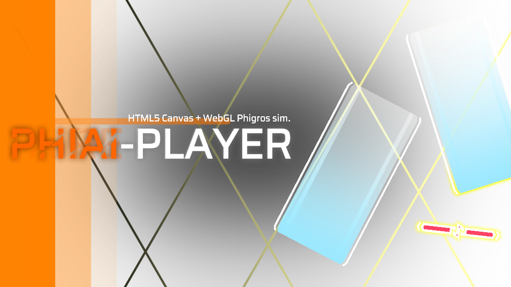

[English](README.md) · **简体中文**

<p align="center">
  
</p>

<h1 align="center">PhiAI-Player</h1>

<p align="center">
  <em>一个直接在浏览器里运行的 Phigros 风格音游播放器 —— 无需安装、无需账号、无需配置。</em>
</p>

<p align="center">
  <a href="LICENSE"></a>
  <a href="https://dvd1145.github.io/PhiAI-Player/"></a>
  <a href="#快速开始"></a>
</p>

---

**把谱面拖进去，两秒开玩。** PhiAI-Player 解析 `.pez` / `.pec` / `.json` 谱面包,加载音频与图片,并在 `<canvas>` 上实时渲染整个游玩过程——下落音符、判定线、连击、计分、打击音效。

点开就能试:**[在线游玩](https://dvd1145.github.io/PhiAI-Player/)**(GitHub Pages)。无需注册、无需下载、无需安装。

---

## 为什么选 PhiAI-Player?

| | Sim-Phi / PhiZone(改版) | PhiAI-Player |
| --- | --- | --- |
| 运行环境 | 需要游戏本体 + 补丁 | **任意现代浏览器** |
| 谱面格式 | 基本只认自家引擎 | **`.pez` / `.pec` / `.zip` / 拖入文件夹** |
| 游玩方式 | 视图固定 | **转盘谱面 + 自动识别 Phi 格式** |
| 单文件构建 | 无 | **有 —— 双击 `dist/rpe-player.html`** |
| 皮肤 / 资源包 | 有限 | **内置资源包 + `.zip` 包加载器** |

它不是改版、不是给已有游戏换皮——它是一个**自包含播放器**,让谱面文件在任何能跑浏览器的地方变成可玩的音游。

> **关于名字:** 最初的原型是用 LLM 随手拼出来的快速读取器("phi… AI"这个工作名就留了下来)。PhiAI-Player 本身**不含任何云端 AI**——它 100% 本地运行,谱面不出本机,断网也能玩。"AI"是名字里的历史,不是包里的功能。

---

## 演示 / 截图

顶部横幅就是真实的进入游戏加载界面。把谱面包拖到页面,你会看到同样的界面,以及实时的下落音符轨道、判定阶梯和连击计数。

*(欢迎在这里放一段 10 秒左右的高难度谱面演示 GIF / 视频——录制后直接替换本小节。)*

---

## 快速开始

**① 在线游玩** — 打开 <https://dvd1145.github.io/PhiAI-Player/>。

**② 准备谱面** — 任意 `.pez` / `.pec` / `.json` 谱面,或一个谱面文件夹。

**③ 开始游戏** — 把文件**拖拽**到页面,或点击**选择文件 / 加载资源包 / 进入谱面文件夹**,再点**游玩**。开箱即有自动演示。

Windows / macOS / Linux,电脑或手机,无需安装任何东西。

开发者方式:

```bash
git clone https://github.com/DVD1145/PhiAI-Player.git
cd PhiAI-Player
python -m http.server 8000      # 开发版布局
# 打开 http://localhost:8000
node build.js                   # → dist/rpe-player.html(单文件构建)
```

直接双击打开 `index.html` 也可以:内置资源包带有嵌入式回退副本,核心功能照常可用。

---

## 功能亮点

- **判定阶梯** — `PERFECT` / `GOOD` / `BAD` / `MISS`,含连击、准确度与实时计分
- **多种游玩方式** — 键盘(任意键自动打击最近音符)、指针 / 触屏(点击、上划、拖划、长按)
- **谱面格式** — `.pez` / `.pec` / `.json`,单文件或整个文件夹;Phi 格式自动识别并在加载时转换
- **录制** — 录下你的游玩过程并导出视频(ffmpeg,按需从 CDN 加载)
- **可换皮肤** — `.zip` 资源包自带音符皮肤、打击音效、歌词(`.lrc` / `.ttml`)与动画 / 视频背景(`extra.json`)
- **特效** — WebGL 后期着色器、粒子打击效果、顺滑的判定线缓动
- 智能:**256 MB 以上的大 `.json` 谱面**采用流式解析,界面不卡顿

---

## 项目状态与路线图

| 状态 | 内容 |
| --- | --- |
| ✅ 可用 | 完整游玩闭环、计分、录制、资源包、特效 |
| 🚧 进行中 | 演示 GIF、更多谱面兼容性边界用例 |
| 📌 计划 | 可选的在线成绩分享、更多无障碍设置 |

单文件构建(`dist/rpe-player.html`)是可部署产物——本仓库则是该文件的源码拆分,便于维护。

> **历史:** 本项目**原名为 AIRE-Player**。更名前的"游玩 UI 编辑器"已停用:它维护困难、存在功能 bug,且可被用于伪造游玩成绩(自定义 HUD 遮挡/替换判定信息)。相关源文件保留在仓库中供参考,但不再加载。

---

## 贡献

欢迎提交 Issue 与 Pull Request。基础约定:

- 保持现有文件布局(`js/player/` 一文件一职责)
- 修改 JS 后运行 `node --check`
- 确认 `node build.js` 仍能产出可运行的 `dist/rpe-player.html`

## 许可证

GPL-3.0——见 [LICENSE](LICENSE)。内置的第三方库、字体与资源包资源遵循各自的许可证/版权——见 [THIRD_PARTY.md](THIRD_PARTY.md)。